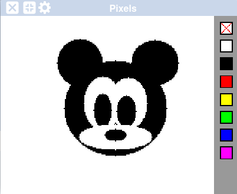

# Projet en programmation de première année.
Ce projet a été réalisé dans le cadre du cours IFT1015 à l'UdeM.
Ce programme crée une interface graphique (sur [codeboot](https://codeboot.org)) où l'on peut :
- Dessiner des ellipses
- Choisir la couleur
- Effacer les dessins

Le code de ce programme n'est surement pas dutout optimisé, c'est bien pour cela que c'est un premier projet de première année.

## Aperçu



## Utilisation

Clone le projet :
```bash
git clone https://github.com/mathispimpare/First-Year-computer-cience-project-ellipse-drawing.git
```

Drag and Drop le fichier `dessiner.py` dans codeboot : https://codeboot.org

Lance le programme :


Une fois le programme lancé, les tests unitaires seront exécutés et il suffit d'aller dans la console et d'appeler la fonction :
```dessiner()```

## Auteur

Créé par **Mathis Pimparé**.

## Licence

Ce projet est sous licence MIT.